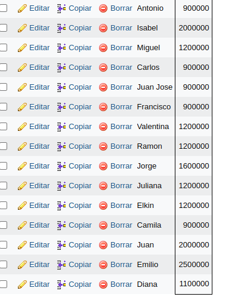

## CONSULTA SQL 2

1. Traer el nombre, cedula y salario de un empleado, ordenando los campos de la siguiente manera: Ascendente por nombre y descendiente por cedula.

SELECT nombre, cedula, sueldo FROM Empleado WHERE (ciudad = 'Medellin') ORDER BY nombre;

SELECT nombre, cedula, sueldo FROM Empleado WHERE (ciudad = 'Medellin')ORDER BY cedula DESC;

2. Traer el nombre y salario de lo primeros 20 empleados cuyo sueldo es mayor de $600000 ordenandolos en forma ascendente por el numero de cedula.

SELECT nombre, sueldo FROM Empleado WHERE (sueldo>600000)ORDER BY cedula LIMIT 20;

3. Mostrar el nombre, id y cedula de los 20 empleados cuyos nombres sean distintos. Orden de la consulta en forma descendente por cedula.

SELECT nombre, Id, cedula FROM Empleado ORDER BY cedula DESC LIMIT 15;

[Consulta3](img/consulta3.png "Consulta3")

4. Entregar los primeros 15 empleados con nombre y cedula cuya ciudad sea bogota. Se necesita que los encabezados de las columnas tengan los siguientes titulos:  
      a. Para el campo NOMBRE-----RAZON SOCIAL
      b. Para el campo CEDULA-----IDENTIFICACION
      c. Ordene la lista en forma descendiente por cedula
    
SELECT nombre AS"Razon social", cedula AS"Identificacion" FROM Empleado WHERE (ciudad = 'Bogota') ORDER BY cedula DESC LIMIT 10;

[Consulta4](img/consulta4.png "Consulta4")

5. Realizar una consulta que entregue el nombre, identificacion, sueldo, edad de los empleados cuyos sueldos esten entre $800000 y $1200000 y cuyas edades esten entre los 23 y 30 años. 

SELECT nombre, cedula, sueldo, edad FROM Empleado WHERE (sueldo BETWEEN 800000 AND 1200000 AND edad BETWEEN 23 AND 35);

[Consulta5](img/consulta5.png "Consulta5")

6. Realizar una consulta que muestre nombre, cedula y salario de los empleados cuyo nombre comience por la letra c. ordene esta lista por salario en forma descendente.

SELECT nombre, cedula, sueldo FROM Empleado WHERE (nombre LIKE 'c%')ORDER BY sueldo DESC;

[Consulta6](img/consulta6.png "Consulta6")
